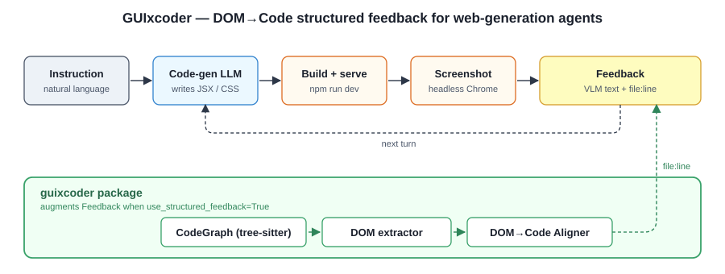
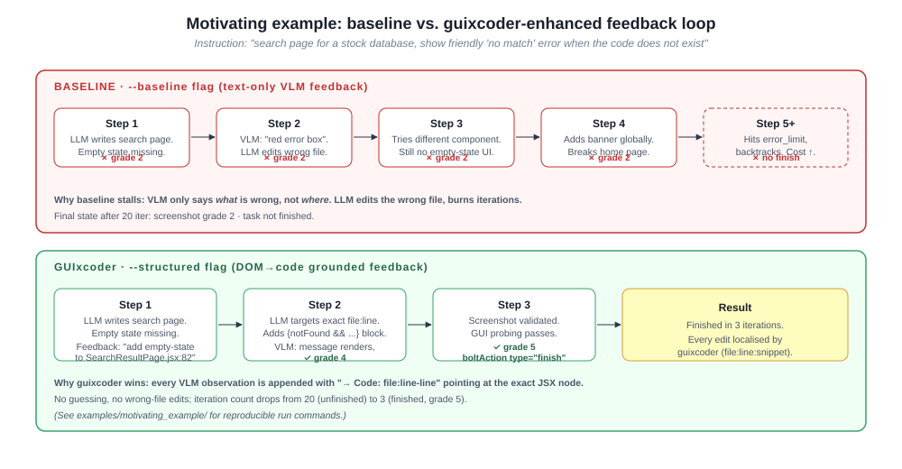

# GUIxcoder

**A web-generation agent that grounds VLM feedback in the source code
graph — so the next-turn LLM knows exactly which `file:line` to fix.**

GUIxcoder is a from-scratch, research-oriented fork of the
[WebGen-Agent](https://arxiv.org/abs/2509.22644) iterative loop with
one focused modification: the feedback channel.  Where the baseline
agent hands the code LLM a free-text VLM description ("*the page has a
red error box*"), GUIxcoder additionally runs a DOM→Code alignment
step and appends the exact code location:

> `→ Code: src/pages/SearchResultPage.jsx:82-84`

<p align="center">
  
</p>

## What's in this repository

| Path | Purpose |
|---|---|
| `agent/` | Full iterative web-generation agent (LLM → files → npm dev → screenshot → VLM → feedback → next turn). Minimal port of WebGen-Agent. |
| `guixcoder/` | **The contribution.** Installable Python package that turns any VLM feedback string into a DOM→Code structured-analysis block. Plugs into the agent via a single flag. |
| `infer.py` | CLI entry point with `--baseline` / `--structured` switch. |
| `examples/motivating_example/` | One reproducible end-to-end comparison showing why structured feedback saves iterations. |
| `docs/figures/` | Architecture diagram + baseline-vs-enhanced iteration comparison. |

## The guixcoder package

Three components, each replaceable:

1. **CodeGraph** — tree-sitter AST of the workspace; every JSX/HTML/CSS
   module, function, component and JSX element becomes a node keyed by
   `file:line_start-line_end`.
2. **DOM extractor** — headless Chromium dump of the live page;
   anomalies (error text, missing elements, broken renders) are
   extracted with class/id/text.
3. **Aligner** — maps each DOM anomaly to the smallest matching
   CodeGraph node.  Ships with a rule-based aligner
   (`class/id match → keyword match → semantic tag match`); a
   contrastive dual-tower model is stubbed for Phase 2.

```python
from guixcoder import FeedbackEnhancer

enhancer = FeedbackEnhancer(workspace_dir="./my-app")
result = enhancer.enhance(
    vlm_feedback="The page shows a red 'No stock found' error box",
    url="http://localhost:5173/search?q=INVALID",
)
print(result.formatted_text)
for loc in result.code_locations:
    print(f"{loc.file}:{loc.line_start}-{loc.line_end}")
```

The agent wraps all of this automatically when you pass `--structured`.

## Agent quickstart

```bash
git clone https://github.com/omgwwcd/GUIxcoder.git
cd GUIxcoder
pip install -e .
cp .env.example .env      # fill in OPENAILIKE_* endpoints (OpenAI, OpenRouter, Ollama, …)
```

Any OpenAI-compatible endpoint works for the three model slots:
`--model` (code generation), `--vlm_model` (screenshot analysis),
`--fb_model` (text summarisation).  For the VLM, a local Ollama
(`qwen2.5-vl:7b` or newer) is enough for the motivating example.

Run the motivating example in the two modes:

```bash
# Baseline — original text-only VLM feedback
python infer.py --instruction "$(cat examples/motivating_example/instruction.txt)" \
    --model "$CODE_MODEL" --vlm_model "$VLM_MODEL" --fb_model "$FB_MODEL" \
    --workspace-dir ./runs/baseline/ws  --log-dir ./runs/baseline/logs \
    --baseline

# GUIxcoder — DOM→Code grounded feedback
python infer.py --instruction "$(cat examples/motivating_example/instruction.txt)" \
    --model "$CODE_MODEL" --vlm_model "$VLM_MODEL" --fb_model "$FB_MODEL" \
    --workspace-dir ./runs/structured/ws --log-dir ./runs/structured/logs \
    --structured
```

Full walkthrough in [`examples/motivating_example/README.md`](examples/motivating_example/README.md).

## Motivating example — why structured feedback matters

<p align="center">
  
</p>

Same instruction, same LLM/VLM, same budget.  The baseline loop stalls
because the VLM only says *what* is wrong; the code LLM edits the wrong
file, and iterations are burned on wrong-direction guesses.  Under
`--structured`, every turn's feedback prompt is extended with
`→ Code: <file>:<line>-<line>` plus the offending snippet, and the
loop converges in a few iterations.

## How the flag works

`WebGenAgent(use_structured_feedback=True)` (the default, also set by
`--structured`) changes exactly two things inside the feedback step:

1. The VLM is called with additional code-structure context via
   `get_screenshot_description_with_context`.
2. After the raw VLM string is composed, `guixcoder.FeedbackEnhancer`
   appends a *Structural Analysis* block with `file:line:snippet`
   hits.

Every other piece of the agent (prompt templates, backtracking, step
persistence, screenshot grading) is identical to the baseline — so the
improvement is attributable to the feedback change, not a scaffolding
difference.

## Related work

| | Focus | Relationship to GUIxcoder |
|---|---|---|
| [WebGen-Agent](https://arxiv.org/abs/2509.22644) | Iterative web generation with multi-level visual feedback | We replace the feedback channel with a DOM→Code-grounded one |
| [Waffle (ACL 2025)](https://arxiv.org/abs/2410.18362) | UI image → HTML via structure-aware attention + contrastive training | Same alignment spirit, but for **generation**; we optimise **feedback** |
| [ScreenCoder](https://arxiv.org/abs/2507.22827) | Modular multi-agent visual-to-code generation | Inspiration for layered feedback |
| [Design2Code](https://arxiv.org/abs/2403.03163), [WebCode2M](https://arxiv.org/abs/2404.06369) | UI↔code benchmarks | Candidate sources for scaling the motivating example into a benchmark |

## Roadmap

- [x] Phase 1 — rule-based aligner, full WebGen-style agent loop,
      motivating example.
- [ ] Phase 2 — contrastive alignment model (dual-tower encoder,
      InfoNCE on (code snippet, DOM subtree) pairs) + training scripts.
- [ ] Phase 3 — feed alignment results back to a GUI-probing agent for
      targeted testing rather than blind coverage.

## License

MIT.  See [LICENSE](LICENSE).  Builds on ideas from WebGen-Agent and
Waffle; please cite the original papers when building on their work.
